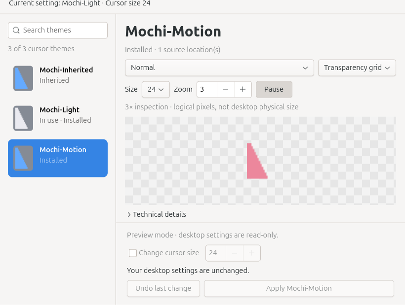

# CursorMochi

A local Linux cursor theme browser built with Rust and GTK4/GIO. **v0.1 candidate: real GNOME Apply/Undo acceptance is still pending.**

Browse installed themes and preview their actual Xcursor files, including animations, cursor roles, nominal sizes, inspection zoom, and hotspots. Desktop settings change only when you explicitly click **Apply** or **Undo**. Applying a theme preserves cursor size unless you opt in to changing it.



## Build and run

Requires Rust 1.98 or later, `pkg-config`, GTK4 development libraries, and a C linker. On Ubuntu, the native packages are `libgtk-4-dev`, `pkg-config`, and `build-essential`. The project does not install system packages automatically.

The declared native API baseline is GTK 4.0 and GLib/GIO 2.66. Testing used GTK 4.22.4 and GLib 2.88.0; older runtimes have not been tested.

```sh
cargo build --release -p cursormochi-gtk --locked
./target/release/cursor-mochi
```

The application works offline. The first Cargo build may download locked dependencies.

To explore original sample assets with desktop writes disabled and an explicitly injected memory settings backend:

```sh
glib-compile-schemas tests/schemas
cargo run --locked -p cursormochi-gtk -- --fixture
```

Other options:

- `--diagnose`: print a read-only, redacted discovery and decoding report without a display.
- `--smoke-test`: run the automated fixture GUI checks and exit; implies `--fixture`.
- `--help`: show command-line options.

Fixture mode loads assets from the source checkout. Normal mode does not depend on the fixture directory.

## Using CursorMochi

1. Search by theme name or ID, then click a row or use the arrow keys. The list includes themes with successfully decoded direct or explicit inherited sources. Automatic fallback to the default theme does not qualify a candidate. Static thumbnails load around the visible rows; **In use** reflects desktop settings independently of your selection.
2. Choose a verified cursor role and a nominal size available in the file. Zoom affects only the preview: **1× means GTK logical pixels**, not necessarily physical screen pixels; 3× is useful for inspection.
3. Choose a light, dark, or transparency-grid background. Animated cursors support pause/play. Expand **Technical details** for hotspots, file sources, inheritance, and original frame data. Hotspots are off by default.
4. Click **Apply [theme]** to change GNOME settings. Enable **Change cursor size** only if you also want to change the desktop cursor size. The host schema validates the allowed range.
5. **Undo** restores the last successful change in this session, including resetting keys that previously had no user override. After A → B → C, Undo returns to B. History does not survive a restart, and conflicting external changes prevent restoration.

Settings readback does not prove that every application's pointer has updated. Unsupported sessions, missing schemas, sandbox restrictions, or locked keys make the application read-only. External settings changes update the current-setting display without changing your selection. Closing during a write waits for bounded verification; it does not implicitly undo the change.

The menu's **Candidate diagnostics** explains excluded candidates. **Copy diagnostics** writes only to the local clipboard and redacts HOME and personal search paths. There is no telemetry or upload.

## Architecture

```text
cursormochi-gtk ──→ app + platform + core
cursormochi-platform ──→ app + core
cursormochi-app ──→ core
cursormochi-core ──→ Rust std
```

Two bounded workers handle scanning/detail decoding and nearby thumbnails. They discard stale results and share a byte-limited decode cache. The list retains at most 16 nearby thumbnails. There is no daemon or Tokio runtime.

The core parser checks input, TOC, dimensions, frame counts, and pixel budgets before allocation. The platform layer uses safe rustix APIs for nonblocking opens, handle checks, and bounded reads. Normal local symlinks are supported; complete protection against filesystem races from the same UID is not claimed.

## Validation

```sh
./scripts/check.sh
python3 scripts/reference-xcursor.py
# Include three isolated GUI styles on an available Wayland display:
./scripts/check.sh --gui
```

GUI checks use a private D-Bus session, read-only fixtures, and an injected memory backend. `GTK_A11Y=none` applies only to the isolated smoke checks; normal startup retains GTK accessibility. A portal timeout was observed in the original user session; private-session fixture checks completed successfully. Do not use the isolated session as evidence of real desktop Apply acceptance.

See the English [polish validation report](docs/POLISH_VALIDATION.md) for results and screenshots. The [historical validation](docs/VALIDATION.md), [environment](docs/ENVIRONMENT.md), [implementation decisions](docs/DECISIONS.md), and original task documents remain available in Chinese as source records.

## Limitations

- Tested locally on Ubuntu Linux x86_64. Real GNOME Apply/Undo, Qt/browser pointer behavior, and fractional scaling still require user acceptance.
- Resolution follows the local libXcursor default path policy. Discovery in additional XDG directories does not prove that the compositor uses those paths; host loader paths remain marked unverified.
- No CUR/ANI support, downloads, theme installation/deletion, store, writes to other desktops, or distribution containers. Only existing local Xcursor assets are previewed.
- Playback clamps delays to 16–10000 ms while preserving original values in details. The interface is English; installed theme names remain unchanged.
- Classification has probe budgets. Candidates without evidence when a budget is exhausted are marked **Unverified**. Partially verified themes carry a warning; classification does not promise exhaustive role coverage.

First-party code and original test fixtures are MIT licensed. Native and transitive dependencies retain their respective licenses.
