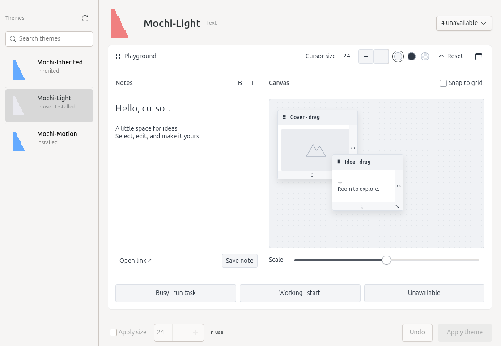

# CursorMochi

A local Linux cursor theme browser built with Rust and GTK4/GIO. **v0.1 candidate: real GNOME Apply/Undo acceptance is still pending.**

Browse installed themes, import supported CUR/ANI files, and preview actual cursor frames, including animations, cursor roles, nominal sizes, inspection zoom, and hotspots. Desktop settings change only when you explicitly click **Apply** or **Undo**. Applying a theme preserves cursor size unless you opt in to changing it.



## Build and run

Requires Rust 1.98 or later, `pkg-config`, GTK4 development libraries, and a C linker. On Ubuntu, the native packages are `libgtk-4-dev`, `pkg-config`, and `build-essential`. The project does not install system packages automatically.

The declared native API baseline is GTK 4.0 and GLib/GIO 2.66. Testing used GTK 4.22.4 and GLib 2.88.0; older runtimes have not been tested.

```sh
cargo build --release -p cursormochi-gtk --locked
./target/release/cursor-mochi
```

The application works offline. The first Cargo build may download locked dependencies.

To explore original sample assets with desktop writes disabled and an explicitly injected memory settings backend:

```sh
glib-compile-schemas tests/schemas
cargo run --locked -p cursormochi-gtk -- --fixture
```

Other options:

- `--diagnose`: print a read-only, redacted discovery and decoding report without a display.
- `--smoke-test`: run the automated fixture GUI checks and exit; implies `--fixture`.
- `--help`: show command-line options.

Fixture mode loads assets from the source checkout. Normal mode does not depend on the fixture directory.

## Using CursorMochi

1. Search by theme name or ID, then click a row or use the arrow keys. Themes in your user theme directories, including imports, appear before system themes, also after restarting. The list includes themes with successfully decoded direct or explicit inherited sources. Automatic fallback to the default theme does not qualify a candidate. Static thumbnails load around the visible rows; **In use** reflects desktop settings independently of your selection.
2. Open **Inspect** and click a cursor thumbnail in the persistent **Cursors** list on the left. Each row shows the role and exact filename; the selected cursor appears on the right. The image area expands with the window and starts at 1× with no added background. Expand **Preview settings & details** to choose a nominal size available in the file. **Busy** and **Working in background** are separate. Additional files in a friendly role group remain selectable as **Role · filename**; unknown roles appear as **Other · filename**. Zoom affects only the preview: **1× means GTK logical pixels**, not necessarily physical screen pixels; 3× is useful for inspection.
3. Animated cursors keep **Pause / Play** in the top toolbar. **Preview settings & details** contains zoom, optional light/dark/transparency-grid backgrounds, hotspots, frame data, file sources, inheritance and environment information. Details scroll within a bounded area so the preview stays usable. Hotspots are off by default; source warnings and operational errors remain visible.
4. Click **Apply [theme]** to change GNOME settings. Enable **Change cursor size** only if you also want to change the desktop cursor size. The host schema validates the allowed range.
5. **Undo** restores the last successful change in this session, including resetting keys that previously had no user override. After A → B → C, Undo returns to B. History does not survive a restart, and conflicting external changes prevent restoration.

Settings readback does not prove that every application's pointer has updated. Unsupported sessions, missing schemas, sandbox restrictions, or locked keys make the application read-only. External settings changes update the current-setting display without changing your selection. Closing during a write waits for bounded verification; it does not implicitly undo the change.

The menu's **Candidate diagnostics** explains excluded candidates. **Copy diagnostics** writes only to the local clipboard and redacts HOME and personal search paths. There is no telemetry or upload.

## Playground and inspection

The default **Playground** page follows the supplied frontend reference: a theme sidebar, an active cursor thumbnail, editable Notes, two movable/resizable cards, grid snapping, card scale, background swatches, and local demo actions. **Reset** restores demo content. **Save note**, **Open link**, and **Busy · run task** affect the demo only.

Use **Inspect** in the title bar for the original role, size, frame, hotspot, and source controls. The pop-out icon at the right of the Playground title bar (**Open trial window**) moves the same Playground into a nonmodal window; clicking again focuses it, and closing returns it to the main window. Theme changes update this shared view. Narrow windows stack Notes above Canvas and scroll while keeping Apply/Undo accessible.

Refresh is beside **Themes**. The main header has a white surface; cursor thumbnails use 44 pixels in the list and 64 pixels in the theme heading. Thumbnails use original decoded source frames, independently of trial cursor size, with crisp enlargement and high-quality downsampling. Notes and formatting share an editor toolbar; link/save actions sit below the editor. Canvas owns snapping and card scale, with roughly 60% of the wide layout. The bottom action bar contains **Apply size**, the current status, **Undo**, and **Apply theme**. Matching settings show **In use**. Availability warnings appear at the right of the theme heading only when needed; click to view missing-role, inheritance, or fallback reasons. Full source/hotspot details live in Inspect.

The playground uses actual GDK texture cursors made from decoded frames and hotspots. Its nominal size, card scale, inspection zoom, and optional GNOME size change are separate controls. Sources, inheritance, automatic fallback, and missing roles remain explicit. Missing roles use the ambient widget pointer and are not counted as theme evidence. Trial interactions do not change desktop settings, theme files, or Undo history.

See [frontend implementation and screenshots](docs/FRONTEND_VALIDATION.md) for the current verification. The earlier [trial validation](docs/TRIAL_VALIDATION.md) retains the user's confirmation of basic real-pointer behavior before this layout update. New layout/region behavior, scaling, and remaining edge cases still require manual acceptance. The import workflow below feeds uninstalled CUR/ANI data into the same inspector and trial engine.

## Testing the current desktop cursor

Open the main menu → **Test current cursor**. This nonmodal window uses system-named GDK cursors from the running desktop, independently of the selected theme. Reopening focuses the same window. The header shows the desktop setting, GTK’s reported theme/size and the window scale; mismatches remain visible. There is no size override, Apply, install or Undo action here.

**Real window** uses the actual title bar, outer edges and four corners for move/resize tests. Its entry, text editor and pane divider are ordinary GTK controls: the test does not override their native cursor behavior or animate decoded textures. Keep the window unmaximized, perform each real resize, then mark the corresponding checkbox. **All roles** has 34 explicit system-named hover targets, including Busy, Working, both diagonals and all eight directional names. Those targets test name requests, not real window resize operations. Mark **Looks correct** or **Problem** yourself; nothing is automatically accepted. The selected-theme Playground remains available separately for decoded-theme trials.

Exact-name file evidence shows direct, inherited, fallback or unverified results, with paths and inheritance chains in tooltips. It does not prove which file GTK/the compositor loaded: legacy aliases, built-in cursors, host search paths and caches can differ. Generic resize assets never count as evidence for a missing directional name. **Recheck files** resets observations and reloads file evidence, not the desktop’s cursor cache. Theme/size/scale changes, refresh and closing reset the session’s checks. No results are saved to disk. See [current cursor validation](docs/CURRENT_CURSOR_VALIDATION.md) for automatic checks and the pending real-pointer checklist.


## Import CUR / ANI themes

Role menus change only through explicit selection; scrolling over a closed menu scrolls the file list. **Reset roles** restores filename suggestions for the whole package, including filtered folders, and clears installation confirmation. If Continue is disabled by duplicate roles, use Reset roles to undo accidental edits or explicitly keep one file for each role. Genuine duplicate suggestions still require your choice.

1. Click **Import…** and open a CUR, ANI, ZIP or extracted folder. The import page immediately shows the entire package: real first-frame thumbnails, filenames, frame counts and editable role suggestions. Select a file to inspect its animation, dimensions and hotspot on the right. Package instructions are never executed.
2. Adjust roles or use **Skip this file** for alternatives you do not want. Duplicate roles are explained at the affected rows; Busy and Working in background remain separate. **Details → Included files** optionally narrows the included files without discarding your mapping edits. There is no mandatory folder-selection page. **Try this theme** uses uninstalled data; **Details → Missing roles & conversion details** exposes the full report.
3. Choose **Continue to install**, edit the suggested name, review included/skipped files, missing roles, conversion details and destination, and tick the confirmation. **Install theme** adds a new theme and rejects existing names. On success, **Done** returns to the main window. The theme list refreshes and selects the result; **Apply theme** remains separate.

The import window opens at 1280×900 logical pixels when the desktop allows it. Compact file rows and an expanding preview canvas leave more room for browsing. Import preview defaults to **No background** and 1× so large cursors are not clipped by the former 180-pixel viewport; zoom, background, size and hotspot controls are under **Preview settings & details**. Routine guidance is hidden when the selection is ready; errors remain visible.

Changing included files, mappings, name or destination clears confirmation. Import review and installation confirmation show a separate **System files: covered/34 · missing** count for the exact names used by **Test current cursor**. Expand **Missing roles & conversion details** to see each missing role and file name. A complete Windows role set does not mean complete system coverage. Partial themes can still be installed after review; missing files may use desktop fallback. Installation checks the verified staged files against the reviewed coverage and saves the same list in `conversion-report.txt`. Confirmed horizontal/vertical resize artwork is also exported as `col-resize` / `row-resize` for native pane dividers; the conversion report records this reuse. Missing roles do not receive fabricated cursors or an implicit imported parent. List thumbnails are static first frames, not evidence of animation playback; the right-hand inspector and theme trial preserve and play the decoded animation. Exports retain original-size variants and add real 16, 24, 32, 48, 64, 96 and 128 px variants. Added variants use area resampling of premultiplied RGBA, scaled/rounded/clamped hotspots, and unchanged frame order and delays. Conversion details disclose the changed pixels. This covers common desktop sizes and their 2× buffers; other requested sizes use the loader’s nearest available variant and still need cross-application verification. Only generated Xcursor files, `index.theme` and `conversion-report.txt` are installed. **Undo** restores desktop settings and does not uninstall files.

Confirmed resize roles also export the directional names used by real window borders and corners, including their legacy Xcursor names. Opposite edges on the same axis reuse the confirmed image without rotating or mirroring it. The standard Windows filenames **Diagonal Resize 1/2** suggest **↖ ↘ / ↗ ↙** respectively. Both suggestions remain editable, and explicitly skipping a recognized diagonal shows a corner-fallback warning. Themes installed with an earlier build are not rewritten: reimport under a new name, confirm both diagonal mappings if available, then explicitly apply the new theme to test real window resizing.

Destinations are the user theme roots (`~/.icons` or `$XDG_DATA_HOME/icons` / `~/.local/share/icons`) that also occur in the application's active cursor lookup paths. Under the existing libXcursor default policy this normally means `~/.icons`; changing lookup paths or desktop settings is never automatic. If no eligible root exists, import preview/trial remains available and installation is disabled.

Supported CUR payloads: bottom-up, uncompressed 24/32-bit BMP with a 40-byte header and explicit AND mask, or noninterlaced RGBA8 PNG. Maximum image dimension is 256. Palette/16-bit/compressed BMP, legacy all-zero-alpha 32-bit cursors, screen-dependent AND/XOR effects, APNG and other unlisted variants fail explicitly. Supported ANI is RIFF/ACON with CUR frames, consistent size variants, sequence/rate tables and 1–600 jiffy delays. There is no silent animated-to-static conversion.

Xcursor stores premultiplied colors and integer millisecond delays: partial-alpha channels can round, hidden RGB is discarded, and ANI jiffies can round to milliseconds. These differences are reported before confirmation and saved with the theme. See [support limits, dependency review and acceptance](docs/IMPORT_VALIDATION.md).

## Architecture

```text
cursormochi-gtk ──→ app + platform + core
cursormochi-platform ──→ app + core
cursormochi-app ──→ core
cursormochi-core ──→ Rust std + ico (CUR pixels)
```

The main window has three bounded workers for scanning/detail decoding, nearby thumbnails, and interactive trial loading. The import window allows one read/install operation at a time plus its bounded trial worker; already-decoded assets are reused across mapping, inspection, trial and export. They discard stale results and share a byte-limited decode cache. The theme and Inspect role lists each retain at most 16 nearby thumbnails and share the existing thumbnail worker; no extra loading thread is added. There is no daemon or Tokio runtime.

The core parser checks input, TOC, dimensions, frame counts, and pixel budgets before allocation. The platform layer uses safe rustix APIs for nonblocking opens, handle checks, and bounded reads. Normal local symlinks are supported; complete protection against filesystem races from the same UID is not claimed.

## Validation

```sh
./scripts/check.sh
python3 scripts/reference-xcursor.py
python3 scripts/reference-import.py  # needs Python 3 and libXcursor.so.1
# Include three isolated GUI styles on an available Wayland display:
./scripts/check.sh --gui
```

GUI checks use a private D-Bus session, original fixtures, and an injected memory backend that rejects settings writes. Import checks install only in a unique `target/qa/import-smoke-*` directory, then remove that test directory. Normal `--fixture` mode disables theme installation. `GTK_A11Y=none` applies only to the isolated smoke checks; normal startup retains GTK accessibility. A portal timeout was observed in the original user session; private-session fixture checks completed successfully. Do not use the isolated session as evidence of real desktop Apply acceptance.

The [GitHub Actions workflow](.github/workflows/ci.yml) pins Ubuntu 24.04 and Rust 1.98.0 for formatting, core/app tests, and native workspace checks. Its first hosted run is pending; local results do not certify that runner environment. See the [closeout validation and manual acceptance checklist](docs/CLOSEOUT_VALIDATION.md) for the earlier closeout results. Current import results and manual gates are in [import validation](docs/IMPORT_VALIDATION.md).

See the English [polish validation report](docs/POLISH_VALIDATION.md) for results and screenshots. The [historical validation](docs/VALIDATION.md), [environment](docs/ENVIRONMENT.md), [implementation decisions](docs/DECISIONS.md), and original task documents remain available in Chinese as source records.

## Limitations

- Tested locally on Ubuntu Linux x86_64. Real GNOME Apply/Undo, Qt/browser pointer behavior, and fractional scaling still require user acceptance.
- Resolution follows the local libXcursor default path policy. Discovery in additional XDG directories does not prove that the compositor uses those paths; host loader paths remain marked unverified.
- CUR/ANI import supports a documented subset, not every Windows cursor variant. No downloads, store, theme overwrite/deletion, INF execution, system-wide installation, writes to other desktops, or distribution containers are provided.
- Playback clamps delays to 16–10000 ms while preserving original values in details. The interface is English; installed theme names remain unchanged.
- Classification has probe budgets. Candidates without evidence when a budget is exhausted are marked **Unverified**. Partially verified themes carry a warning; classification does not promise exhaustive role coverage.

First-party code and original test fixtures are MIT licensed. Native and transitive dependencies retain their respective licenses.
